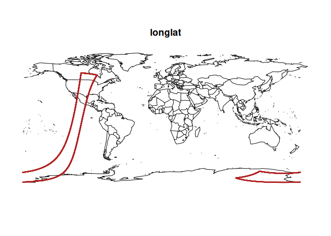
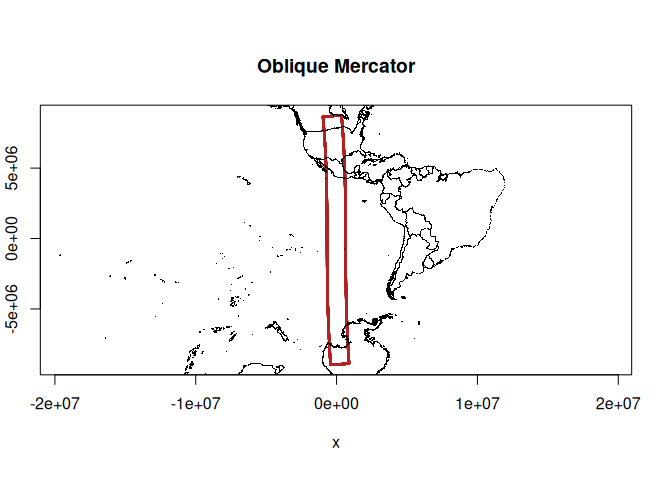
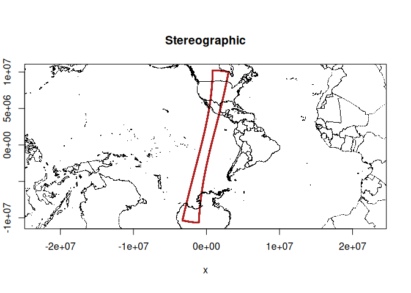
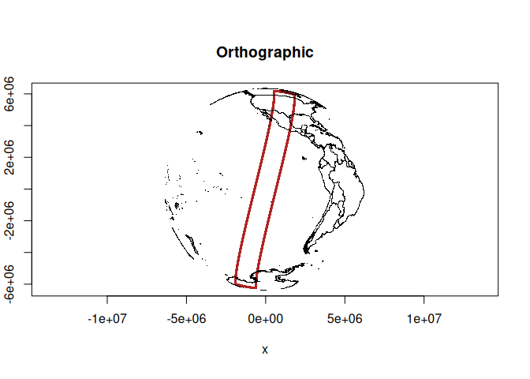
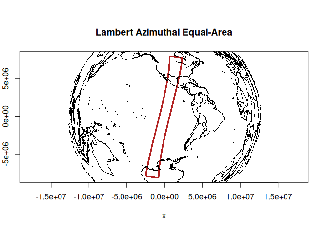

<!-- README.md is generated from README.Rmd. Please edit that file -->

# gproj

<!-- badges: start -->
<!-- badges: end -->

The goal of gproj is to encapsulate some map projection and grid logic.

## Installation

You can install the development version of gproj from
[GitHub](https://github.com/) with:

``` r
# install.packages("pak")
pak::pak("mdsumner/gproj")
```

## Nothing yet

Here’s my rough todo and examples.

``` r
# 1. an object that stores crs and just does the forward or inverse as asked
# 2. methods that take longlat values and a family and generate a crs
# 3. methods to find the middle of values
# 4. methods to find the area
#devtools::load_all()
source("R/gproj.R")

## with this S7 class we can always project or unproject (intentionally, without juggling to/from defs)
gproj()@proj_xy(cbind(0, 0)) #no-op
#>      x y
#> [1,] 0 0
gproj("+proj=laea +lon_0=-147")@proj_xy(cbind(0, 0)) # fwd
#>             x y
#> [1,] 12230967 0
gproj("+proj=laea +lon_0=-147")@proj_ll(cbind(12230967.25458603, 0)) # inv
#>                 x y
#> [1,] 1.017777e-13 0

omerc <- gproj("+proj=omerc +lonc=-113 +lat_0=-20 +alpha=15 +gamma=1")

## this is a swath boundary
load("data/viirs_boundary.rda")

## this is just coastal/country points
mp <- do.call(cbind, maps::map(plot = F)[1:2])
#par(mfrow = c(2, 2), mar = rep(0, 4))
maps::map()
points(viirs_boundary, cex = .2, col = "firebrick")
title("longlat")
```



``` r

plot(omerc@proj_xy(viirs_boundary), cex = .2, col = "firebrick", asp = 1)
points(omerc@proj_xy(mp), pch = ".")
title("Oblique Mercator")
```



``` r

## with params() we can provide raw data and have it figure out a sensible set of params
(prj <- proj(params(viirs_boundary), "stere"))
#> [1] "+proj=stere +lon_0=-113 +lat_0=-20"
plot(gproj(prj)@proj_xy(viirs_boundary), cex = .2, col = "firebrick", asp = 1)
points(gproj(prj)@proj_xy(mp), pch = ".")
title("Stereographic")
```



``` r

## if we are conic we get extra secant lat_1/lat_2 (can we do similar this for omerc ...)
(prj <- proj(params(viirs_boundary, secant = TRUE), "lcc"))
#> [1] "+proj=lcc +lon_0=-113 +lat_0=-20 +lat_1=-84 +lat_2=57"

(prj <- proj(params(viirs_boundary), "ortho"))
#> [1] "+proj=ortho +lon_0=-113 +lat_0=-20"
plot(gproj(prj)@proj_xy(viirs_boundary), cex = .2, col = "firebrick", asp = 1)
points(gproj(prj)@proj_xy(mp), pch = ".")
title("Orthographic")
```



``` r


(prj <- proj(params(viirs_boundary), "laea"))
#> [1] "+proj=laea +lon_0=-113 +lat_0=-20"
plot(gproj(prj)@proj_xy(viirs_boundary), cex = .2, col = "firebrick", asp = 1)
points(gproj(prj)@proj_xy(mp), pch = ".")
title("Lambert Azimuthal Equal-Area")
```



## Code of Conduct

Please note that the gproj project is released with a [Contributor Code
of
Conduct](https://contributor-covenant.org/version/2/1/CODE_OF_CONDUCT.html).
By contributing to this project, you agree to abide by its terms.
